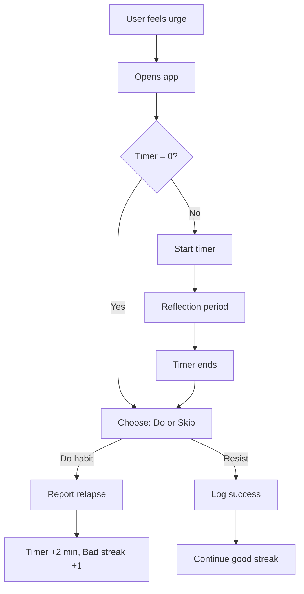
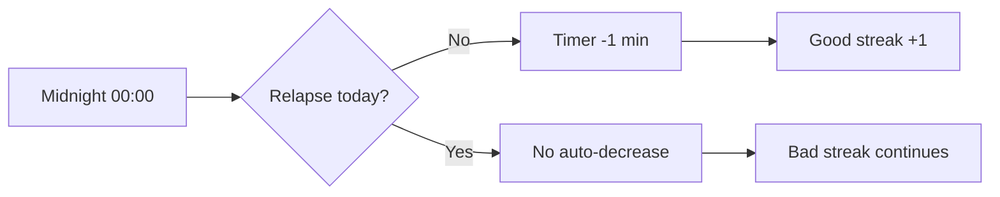

# Habitimer - Habit Breaking Timer App

## 🎯 Core Concept

**Habitimer** is a behavioral intervention app designed to help users break bad habits through a progressive delay mechanism. The app uses a dynamic timer system that creates a mandatory reflection period before the user can engage in their unwanted habit.

### The Psychology

- **Impulse Control**: By introducing a waiting period, the app breaks the automatic habit loop
- **Self-Reflection**: The timer creates space for mindful consideration instead of impulsive action
- **Progressive Resistance Training**: Success makes future resistance easier; relapse makes it harder
- **Natural Consequences**: The systemself-regulates based on user behavior

---

## ⚙️ Core Mechanics

### Timer Rules

| Condition | Timer Change | Max/Min |
|-----------|-------------|---------|
| Daily auto-decrease | -1 minute | Minimum: 0 min |
| User reports relapse | +2 minutes | Maximum: 90 min |
| Initial state | 0 minutes | Starting point |

### Streak System

**Good Streak**
- Increments each day without relapse
- Influences timer decrease rate (potential multiplier)
- Visual reward and motivation

**Bad Streak**
- Increments with consecutive relapses
- Influences timer increase rate (potential multiplier)
- Visual warning and intervention

---

## 🔄 User Flow

### Daily Usage



### Daily Auto-Update



---

## 🎨 UI/UX Design Philosophy

### Visual Identity

**Aesthetic**: Calm, minimal, supportive (not punitive)

**Color Palette**
- Primary: Soft blues and greens (calming)
- Success: Gentle green gradients
- Warning: Warm amber (not aggressive red)
- Background: Off-white or light gray with subtle textures

**Typography**
- Clean, readable sans-serif
- Large, clear timer display
- Supportive micro-copy

### Key Screens

#### 1. **Home Screen - Timer Display**
```
┌─────────────────────────┐
│   🌿 Habitimer          │
│                         │
│      ⏱️                 │
│     23:45               │
│   (time remaining)      │
│                         │
│  ═══════════════════    │
│  Progress bar           │
│                         │
│  📊 Streaks             │
│  Good: 5 days 🔥        │
│  Bad:  0 days           │
│                         │
│  [Start Timer] button   │
│                         │
│  Daily auto-decrease    │
│  in 6h 15m              │
└─────────────────────────┘
```

#### 2. **Timer Active Screen**
```
┌─────────────────────────┐
│                         │
│   Take a breath...      │
│                         │
│      ⏱️                 │
│     15:30               │
│                         │
│  ●●●●●●●●○○○○           │
│  Circular progress      │
│                         │
│  "This urge will pass"  │
│  Breathing animation    │
│                         │
│  [Cancel] [Background]  │
└─────────────────────────┘
```

#### 3. **Decision Screen** (Timer Complete)
```
┌─────────────────────────┐
│                         │
│   Time's up ✨          │
│                         │
│  How do you feel now?   │
│                         │
│  ┌────────────────────┐ │
│  │  I resisted 💪     │ │
│  │  (Log success)     │ │
│  └────────────────────┘ │
│                         │
│  ┌────────────────────┐ │
│  │  I relapsed        │ │
│  │  (That's okay)     │ │
│  └────────────────────┘ │
│                         │
│  Your timer: 15 min     │
└─────────────────────────┘
```

#### 4. **Statistics & Progress**
```
┌─────────────────────────┐
│   📊 Your Journey       │
│                         │
│  Current Timer: 15 min  │
│  ▼ 5 min this week      │
│                         │
│  ┌─────────────────┐   │
│  │ Week view graph │   │
│  │ Timer history   │   │
│  └─────────────────┘   │
│                         │
│  Best Streak: 12 days   │
│  Current: 5 days 🔥     │
│                         │
│  Milestones:            │
│  ✅ 1 day clean         │
│  ✅ 1 week clean        │
│  🔒 1 month clean       │
└─────────────────────────┘
```

---

## ✨ Features & Animations

### Core Features

1. **Dynamic Timer**
   - Large, clear countdown display
   - Smooth transitions on value changes
   - Haptic feedback at key moments

2. **Streak Tracking**
   - Dual streak system (good/bad)
   - Streak multipliers for timer adjustments
   - Visual streak celebrations

3. **Reflection Period**
   - Breathing animations during wait
   - Supportive messages
   - Background timer option

4. **Daily Reset**
   - Automatic timer decrease at midnight
   - Notification of change
   - New day celebration

5. **Statistics Dashboard**
   - Timer history graph
   - Success rate
   - Milestone achievements

6. **Motivational System**
   - Encouraging quotes
   - Progress celebrations
   - Non-judgmental relapse handling

### Animations

**Screen Transitions**
- Smooth fade and slide transitions
- Page curl for statistics
- Gentle bounces on success

**Timer Animations**
- Pulsing glow during active countdown
- Circular progress indicator
- Satisfying completion animation

**Breathing Guide** (during timer)
- Expanding/contracting circle
- Color shifts (inhale: blue, exhale: green)
- Gentle rhythm (4-7-8 pattern)

**Success Celebrations**
- Confetti burst (subtle, not overwhelming)
- Gentle grow/shrink animation
- Positive color washes

**Streak Flames**
- Flickering fire animation for streaks
- Growing flames with higher numbers
- Smooth extinguish on reset

---

## 🔧 Technical Implementation (Flutter)

### State Management
- **Recommended**: Riverpod or Bloc
- Timer state
- Streak state
- User history

### Local Storage
- **SharedPreferences** for simple data
- **Hive** or **Sqflite** for history logging

### Background Processing
- **WorkManager** (Android) / **Background Fetch** (iOS)
- Daily auto-decrease at midnight
- Timer continuation in background

### Notifications
- **flutter_local_notifications**
- Daily reminder
- Timer completion
- Milestone achievements

### Animations
- **AnimatedContainer** for size/color changes
- **TweenAnimationBuilder** for custom animations
- **Rive** for complex breathing animations
- **Lottie** for celebrations

---

## 📊 Advanced Streak Mechanics

### Good Streak Multipliers

| Good Streak | Daily Decrease | Effect |
|-------------|----------------|--------|
| 0-6 days    | -1 min         | Standard |
| 7-13 days   | -1.5 min       | Week milestone |
| 14-29 days  | -2 min         | Strong progress |
| 30+ days    | -3 min         | Mastery level |

### Bad Streak Penalties

| Bad Streak  | Relapse Increase | Intervention |
|-------------|------------------|--------------|
| 0 days      | +2 min           | Standard |
| 2-3 days    | +3 min           | Warning message |
| 4-6 days    | +4 min           | Support resources |
| 7+ days     | +5 min           | Crisis help offer |

### Reset Conditions

- **Good streak resets** on any relapse
- **Bad streak resets** after 24 hours with no relapse
- **Timer continues** to decrease even if streaks reset

---

## 🎁 Additional Features (Future Enhancements)

### Phase 1 (MVP)
- ✅ Basic timer system
- ✅ Streak tracking
- ✅ Daily auto-decrease
- ✅ Simple statistics

### Phase 2
- 📱 Alternative activities suggestions during timer
- 🎯 Custom habit naming
- 📈 Weekly progress reports
- 🌙 Dark mode

### Phase 3
- 🔔 Smart notification timing
- 💬 Journaling during reflection
- 🏆 Achievement badges
- 📊 Export data

### Phase 4
- 👥 Anonymous community support
- 🎨 Theming options
- 🔗 Integration with habit trackers
- 🧠 AI-powered insights

---

## 🎯 Success Metrics

### User Engagement
- Daily app opens during urges
- Timer completion rate
- Streak milestones reached

### Behavior Change
- Increasing good streaks
- Decreasing bad streaks
- Reducing average timer value
- Time to reach 0 minutes

### User Satisfaction
- Feeling of control
- Reduction in guilt/shame
- Increased mindfulness

---

## 🧠 Psychological Foundations

### Techniques Used

1. **Delay Discounting**
   - Immediate rewards (bad habit) vs. delayed rewards (health)
   - Timer introduces temporal distance

2. **Mindful Awareness**
   - Breaking automatic responses
   - Creating space for conscious choice

3. **Progressive Exposure**
   - Building tolerance to urges
   - Increasing resistance capacity

4. **Self-Compassion**
   - Non-punitive relapse handling
   - Supportive messaging
   - Focus on progress, not perfection

5. **Gamification**
   - Streaks as game elements
   - Milestones as achievements
   - Visual progress tracking

---

## 🎨 Icon Suggestions

### Main Navigation
- 🏠 Home: House or circle
- 📊 Stats: Bar chart
- ⚙️ Settings: Gear
- 💡 Tips: Light bulb

### Timer States
- ⏱️ Active: Clock/hourglass
- ✅ Success: Check mark
- 🔄 Reset: Circular arrow
- 🔥 Streak: Flame

### User Actions
- ▶️ Start timer: Play button
- ⏸️ Pause: Pause (if allowed)
- 🏁 Complete: Flag
- 📝 Log: Pencil

### Emotional States
- 😌 Calm: Meditation icon
- 💪 Strong: Flexed arm
- 🌱 Growth: Seedling
- ✨ Achievement: Sparkles

---

## 📋 Data Schema

### User Profile
```dart
class UserProfile {
  String habitName;
  int currentTimer; // in minutes
  int goodStreak;
  int badStreak;
  DateTime lastReset;
  int totalRelapses;
  int totalSuccesses;
}
```

### Daily Log
```dart
class DailyLog {
  DateTime date;
  int timerValue; // at start of day
  bool hadRelapse;
  int timesUsedTimer;
  int timesResisted;
}
```

### Timer Session
```dart
class TimerSession {
  DateTime startTime;
  int duration; // in seconds
  bool completed;
  String outcome; // 'resisted', 'relapsed', 'cancelled'
  String? notes;
}
```

---

## 🚀 Launch Strategy

### Onboarding Flow
1. Welcome & explanation
2. Identify the habit (private, not stored elsewhere)
3. Set initial timer (suggest 0, explain mechanics)
4. Demonstrate timer usage
5. Enable notifications

### First-Time Experience
- Tutorial overlay
- Simplified first screen
- Quick win opportunity
- Educational tooltips

---

## 💡 Key Differentiators

Unlike other habit trackers:
- ✨ **Not punitive**: Focuses on building capacity
- 🧘 **Mindfulness-first**: Creates reflection space
- 📈 **Self-adjusting**: Timer adapts to userProgress
- 🎯 **Single focus**: One habit at a time for maximum impact
- 🌊 **Calm by design**: Reduces anxiety, doesn't increase it

---

## 🎭 Brand Voice

**Supportive, not preachy**
- "You've got this" not "You must do this"
- "That's okay" not "You failed"
- "Progress" not "Perfection"

**Calm and encouraging**
- Gentle reminders
- Celebration of small wins
- Compassionate relapse messaging

**Empowering**
- User in control
- Building skills
- Growing stronger

---

## 📱 Platform Considerations

### Flutter Advantages
- Single codebase (iOS + Android)
- Rich animation library
- Material Design + Cupertino widgets
- Strong local storage options

### Platform-Specific
- **iOS**: SF Symbols for icons
- **Android**: Material Design 3
- **Both**: Native notification styles

---

## 🔐 Privacy & Ethics

### Data Privacy
- All data stored **locally**
- No cloud sync (optional feature later)
- No personal information collection
- No analytics without consent

### Ethical Design
- No dark patterns
- No infinite engagement loops
- True utility over engagement metrics
- User agency maintained

---

*Habitimer: Break habits, build capacity, one minute at a time.*
